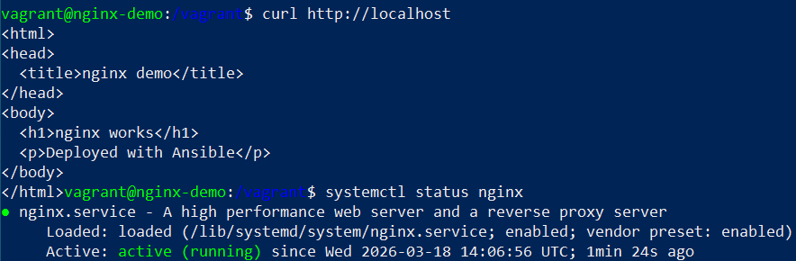

ansible-nginx-demo

Демонстрационный проект с Ansible и nginx.

Описание:

Playbook автоматически настраивает nginx на Ubuntu:

- устанавливает nginx
- запускает сервис
- включает автозапуск
- создаёт простую HTML-страницу

Файлы проекта:

- `playbook.yml` — основной Ansible playbook
- `inventory.ini` — inventory для запуска
- `README.md` — описание проекта

Требования:

- Ubuntu LTS
- Python 3
- Ansible

Команда для запуска:

ansible-playbook -i inventory.ini playbook.yml

Пример результата:

